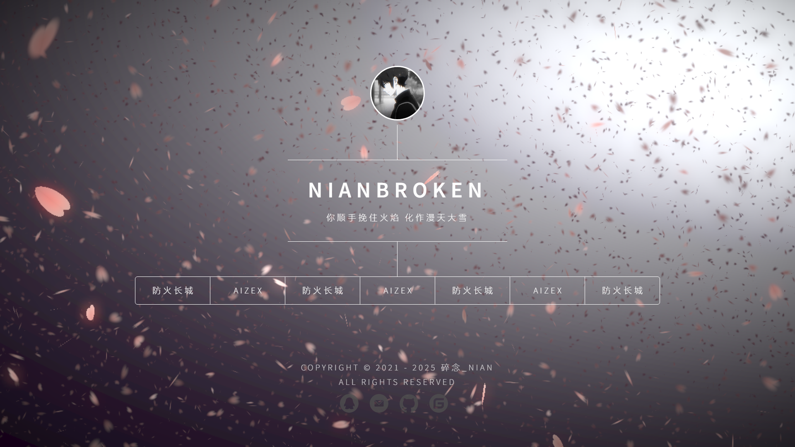

# 个人樱花引导页

## 预览

- [https://nianbroken.github.io/Personal_Sakura_Guide_Page/](https://nianbroken.github.io/Personal_Sakura_Guide_Page/)

---

## 声明

有一部分人使用了我的开源代码搭建付费或商用网站，其中以售卖游戏外挂的站点居多。这些站点在用户付款后，往往会立即将用户拉黑并直接跑路。

上述人员在使用代码时没有修改我在项目中设置的默认联系方式，导致不少受骗用户通过网站底部的联系方式找到我。受骗用户在联系时常将责任归咎于我，认为跑路的人是我，并指认我骗取了他们的钱。

因此，凡使用本代码搭建网站，必须将项目中的联系方式改为你们自己的，不得继续使用默认联系方式。若仍未修改并由此造成他人受骗，我将配合受骗用户报警并向警方提供线索，协助锁定并追查实际跑路的站长。

---

## 许可证

`Copyright © 2022 NianBroken. All rights reserved.`

本项目采用 [Apache-2.0](https://www.apache.org/licenses/LICENSE-2.0) 许可证。简而言之，你可以自由使用、修改和分享本项目的代码，但前提是在其衍生作品中必须保留原始许可证和版权信息，并且必须以相同的许可证发布所有修改过的代码。

## 特别感谢

- [dimension](https://html5up.net/dimension)

- [fwxiaohan](https://fwxiaohan.github.io/)

## 最便宜的 VPN

[https://nianbroken.github.io/Great-Firewall/](https://nianbroken.github.io/Great-Firewall/)

## 性价比最高的 ChatGPT 镜像站
[Aizex 合租面板](https://aizex.klaio.top/)

## 其他

欢迎提交 `Issues` 和 `Pull requests`
