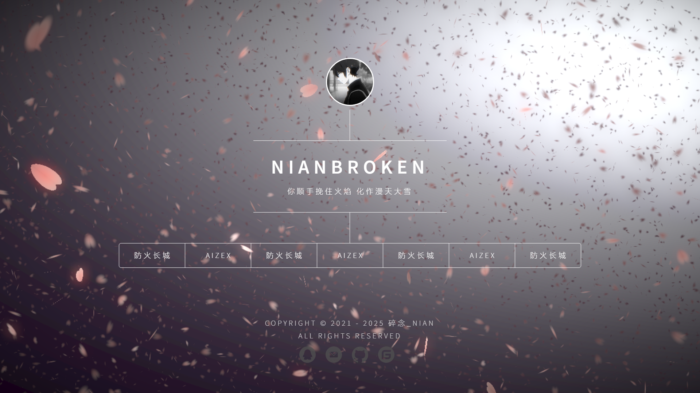

# 个人樱花引导页

## 预览

- [https://nianbroken.github.io/Personal_Sakura_Guide_Page/](https://nianbroken.github.io/Personal_Sakura_Guide_Page/)

## 项目结构

- `index.html`
  页面骨架，只保留首屏结构、资源入口和语义化标记。

- `assets/styles/`
  页面样式目录。
  `base.css` 负责全局变量、重置和基础排版。
  `home.css` 负责首页布局和动效。
  `noscript.css` 负责无脚本兜底显示。

- `assets/scripts/app/`
  页面启动逻辑目录。
  `bootstrap.js` 负责年份更新、预加载状态切换和樱花初始化。

- `assets/scripts/effects/sakura/`
  樱花背景目录。
  配置、数学工具、WebGL 工具、着色器源码和渲染器各自独立。

- `assets/images/`
  页面静态资源目录。
  `branding/` 存放头像和站点图标。
  `social/` 存放联系方式图标。
  `previews/` 存放文档预览图。

## 声明

有一部分人使用了我的开源代码搭建付费或商用网站，其中以售卖游戏外挂的站点居多。这些站点在用户付款后，往往会立即将用户拉黑并直接跑路。

上述人员在使用代码时没有修改我在项目中设置的默认联系方式，导致不少受骗用户通过网站底部的联系方式找到我。受骗用户在联系时常将责任归咎于我，认为跑路的人是我，并指认我骗取了他们的钱。

因此，凡使用本代码搭建网站，必须将项目中的联系方式改为你们自己的，不得继续使用默认联系方式。若仍未修改并由此造成他人受骗，我将配合受骗用户报警并向警方提供线索，协助锁定并追查实际跑路的站长。

## 许可证

`Copyright © 2022 NianBroken. All rights reserved.`

本项目采用 [Apache-2.0](https://www.apache.org/licenses/LICENSE-2.0) 许可证。你可以自由使用、修改和分享本项目代码，但必须保留原始版权和许可证信息。

## 特别感谢

- [dimension](https://html5up.net/dimension)
- [fwxiaohan](https://fwxiaohan.github.io/)

## 恰饭

- [Great-Firewall](https://nianbroken.github.io/Great-Firewall/) 好用的 VPN
- [Ciii](https://ciii.klaio.top/) Codex 中转
- [Aizex](https://aizex.klaio.top/) ChatGPT 镜像站
